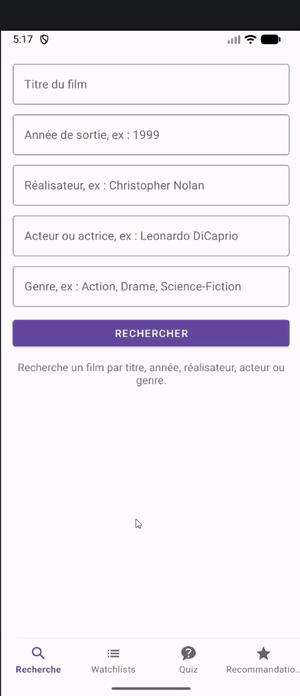
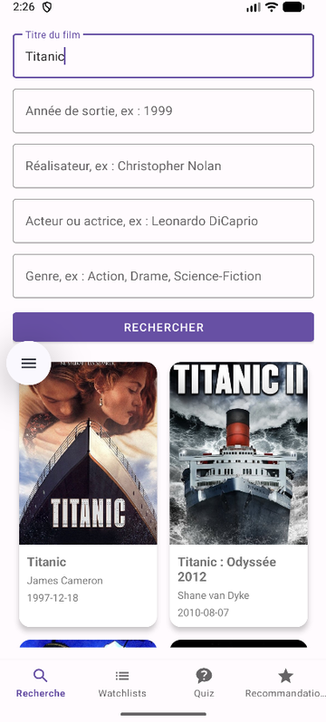
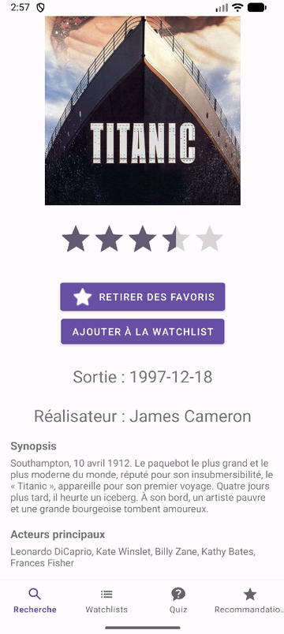
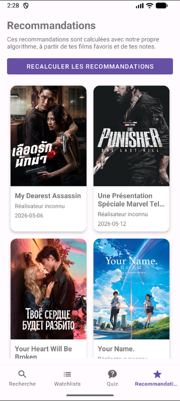
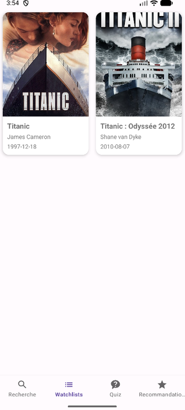
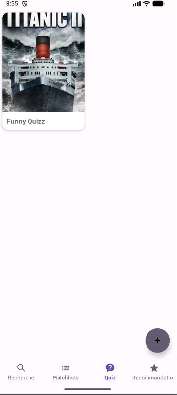
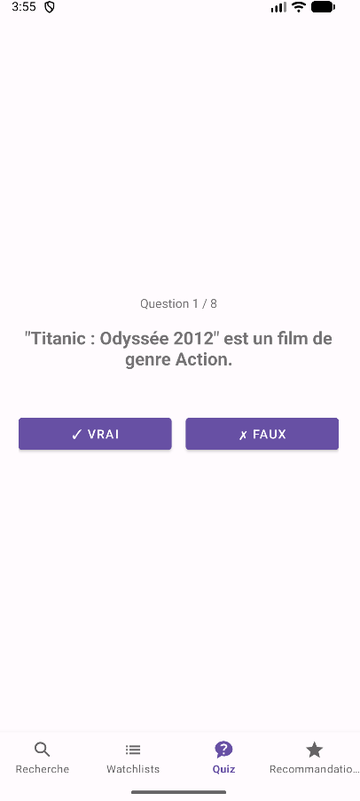
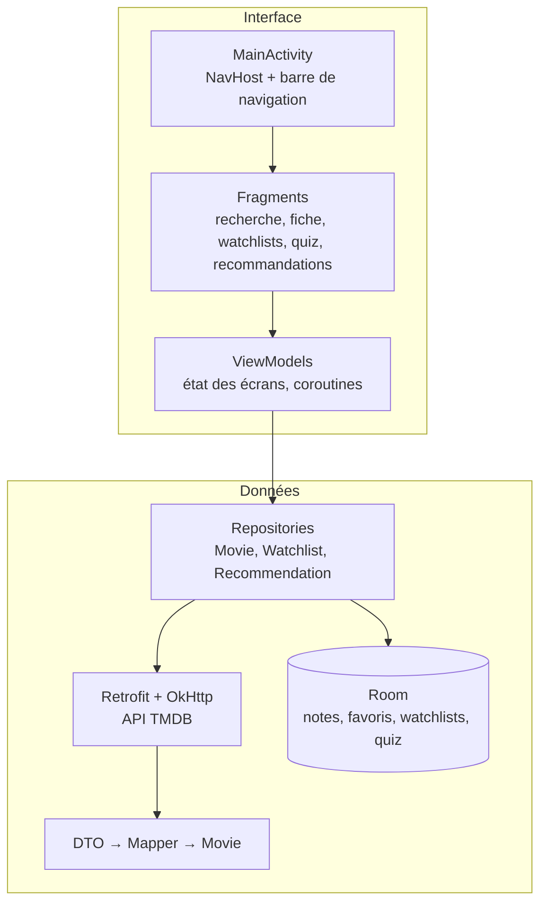

# Cinephile

[](https://github.com/rp-projects-devs/cinephile/actions/workflows/android.yml)

**Application Android en Kotlin pour explorer des films, les organiser en watchlists, jouer à des quiz générés automatiquement et recevoir des recommandations personnalisées.** Les données viennent de l'API [TMDB](https://www.themoviedb.org/) ; les notes, favoris, watchlists et quiz sont conservés sur le téléphone.

<p align="center">
  
</p>

## Fonctionnalités

<table>
  <tr>
    <td align="center"><br><b>Recherche</b></td>
    <td align="center"><br><b>Fiche d'un film</b></td>
    <td align="center"><br><b>Recommandations</b></td>
  </tr>
  <tr>
    <td align="center"><br><b>Watchlists</b></td>
    <td align="center"><br><b>Quiz</b></td>
    <td align="center"><br><b>Question vrai / faux</b></td>
  </tr>
</table>

- **Recherche multicritère** par titre, année, réalisateur, acteur ou genre, combinables entre eux. Les résultats s'affichent en grille avec poster, réalisateur et date de sortie.
- **Fiche détaillée** : poster, synopsis, date, réalisateur et casting principal. On peut noter le film de 0,5 à 5 étoiles et l'ajouter aux favoris.
- **Watchlists** nommées librement. Un appui long permet de renommer une watchlist, de la supprimer ou de la définir comme « actuelle » ; un appui long sur un résultat de recherche l'ajoute directement à la watchlist actuelle.
- **Quiz vrai / faux** générés à partir des films d'une watchlist : date de sortie, réalisateur, acteur principal et genre.
- **Recommandations** calculées par notre propre algorithme à partir des notes et des favoris, sans utiliser le système de recommandation de TMDB.
- Les données personnelles restent **sur l'appareil** (base Room) et survivent à la fermeture de l'application et aux rotations d'écran.

## Architecture

L'application suit une architecture **MVVM** autour d'une seule activité et de fragments reliés par le Navigation Component.



| Couche | Rôle | Fichiers principaux |
|---|---|---|
| `ui/` | Fragments et ViewModels de chaque écran ; les ViewModels exposent un état que les fragments observent | `SearchFragment`, `MovieDetailsViewModel`, `QuizPlayViewModel`… |
| `domain/` | Modèle métier indépendant d'Android, et logique pure | `Movie`, `SearchFilters`, `QuizGenerator` |
| `data/remote/` | Description des points d'accès TMDB et objets de transfert (DTO) | `TmdbApi`, `TmdbClient`, `dto/` |
| `data/mapper/` | Conversion des DTO en modèle métier | `MovieMapper` |
| `data/bdd/` | Base locale Room : entités et DAO | `AppDatabase`, `FilmDao`, `WatchlistDao`, `QuizDao` |
| `data/repository/` | Point d'entrée unique des données pour les ViewModels | `MovieRepository`, `WatchlistRepository`, `RecommendationRepository` |

### Choix techniques

- **Kotlin, coroutines et Flow** : les appels réseau et les requêtes Room sont suspendus et exécutés hors du fil principal ; les listes stockées en base sont observées en continu avec `Flow`.
- **Retrofit, OkHttp et Gson** pour l'API TMDB. Un intercepteur ajoute la clé API à chaque requête ; la journalisation des requêtes n'est active qu'en debug, puisque les URL contiennent la clé.
- **Room** pour la persistance : quatre tables (films notés, watchlists, films des watchlists avec clé étrangère et suppression en cascade, quiz).
- **Navigation Component et View Binding** pour la navigation entre écrans et l'accès typé aux vues.
- **Coil** pour le chargement asynchrone des posters.
- **Mise en page paysage dédiée** pour la recherche et les recommandations, afin que les champs ne masquent pas les résultats.

### Recherche

TMDB ne permet pas de combiner tous les critères dans une seule requête. Le `MovieRepository` choisit donc la requête la plus sélective (titre, puis réalisateur, puis acteur, puis genre ou année), charge en parallèle les détails des 24 premiers résultats avec `async`, puis applique localement l'ensemble des filtres. La comparaison des genres ignore les accents et la casse : « science fiction » trouve « Science-Fiction ».

### Algorithme de recommandation

1. **Profil** : chaque film noté ou mis en favori reçoit un poids. Un favori vaut +3, une note de 4,5 ou plus +3, une note de 3,5 ou plus +2, et une note de 2 ou moins −2.
2. **Genres préférés** : le poids de chaque film est ajouté à chacun de ses genres. Les trois genres au meilleur score positif sont retenus.
3. **Candidats** : pour chacun de ces genres, les films les plus populaires sont récupérés sur TMDB, en parallèle. Les films déjà notés ou mis en favori sont écartés.
4. **Classement** : chaque candidat est noté par la somme des scores de ses genres, plus 0,7 × sa note TMDB, plus un petit bonus de popularité plafonné. Les 20 meilleurs sont affichés.

Un film mal noté fait donc baisser ses genres, et un film aimé de plusieurs genres les renforce tous.

### Génération des quiz

Pour chaque film de la watchlist, `QuizGenerator` peut créer une question par information disponible : année, réalisateur, acteur principal et genre. Une fois sur deux, l'affirmation est volontairement fausse : la valeur est empruntée à un autre film de la watchlist. Une question fausse n'est créée que si la valeur empruntée diffère réellement de la bonne réponse, pour éviter les questions ambiguës ; elle est abandonnée sinon.

## Installer et lancer le projet

Prérequis : [Android Studio](https://developer.android.com/studio) récent (JDK 17 inclus) et un appareil ou un émulateur sous Android 10 (API 29) ou plus récent.

1. **Obtenir une clé API TMDB**, gratuite : créer un compte sur [themoviedb.org](https://www.themoviedb.org/), puis *Paramètres → API*. Copier la « clé d'API » (v3).
2. **Cloner le dépôt** et l'ouvrir dans Android Studio.
3. **Renseigner la clé** : à la racine du projet, copier `local.properties.example` en `local.properties` et remplacer la valeur de `TMDB_API_KEY`. Ce fichier est ignoré par Git : la clé ne sera jamais publiée.
4. **Lancer** l'application avec le bouton *Run*.

Sans clé, l'application démarre mais la recherche affiche un message demandant de la configurer.

En ligne de commande :

```sh
./gradlew assembleDebug        # APK dans app/build/outputs/apk/debug/
./gradlew testDebugUnitTest    # tests unitaires
```

## Tests

Les tests unitaires couvrent la logique indépendante d'Android :

- `SearchFiltersTest` : critères vides, validation et normalisation de l'année ;
- `MovieTest` : URL des posters, année de sortie, libellés par défaut ;
- `MovieMapperTest` : conversion des réponses TMDB, choix du réalisateur, tri et limite du casting ;
- `QuizGeneratorTest` : questions produites pour un film, informations manquantes, et cohérence de chaque question vraie ou fausse vérifiée sur 300 générations aléatoires.

L'intégration continue GitHub Actions lance les tests et compile l'APK à chaque push.

## Limites connues

- **Questions de quiz génériques** : elles se limitent aux informations fournies par TMDB (année, réalisateur, acteur, genre).
- **Réalisateur absent des cartes de recommandation** : la requête `discover` de TMDB ne renvoie pas l'équipe du film, d'où la mention « Réalisateur inconnu ». Il faudrait une requête de détails par recommandation.
- **Migrations de base destructives** : un changement de schéma Room efface les données locales au lieu de les migrer.
- **Clé API embarquée dans l'APK** : c'est inhérent à une application sans serveur. Une version publiée devrait passer par un serveur intermédiaire qui détient la clé.
- **Interface uniquement en français.**

## Contexte

Projet réalisé en binôme dans le cadre d'un cours de développement mobile.

## Crédits

This product uses the TMDB API but is not endorsed or certified by TMDB. Les données et les affiches de films appartiennent à leurs ayants droit respectifs.

## Licence

Code distribué sous licence MIT, voir [`LICENSE`](LICENSE).
